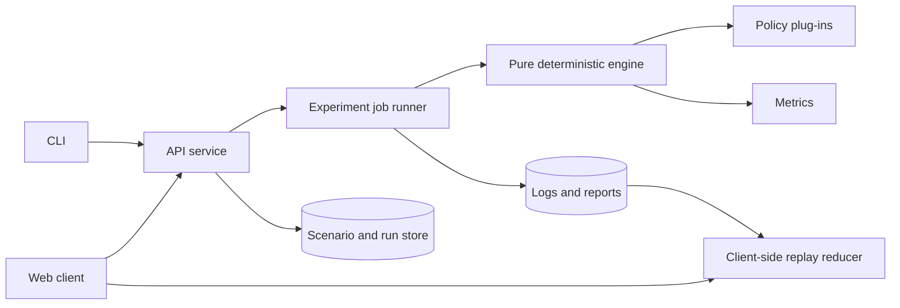

# Complete Self-Defense Scenario Combat Simulator: Implementation Plan

## 1. Product Goal

Build a deterministic, explainable scenario simulator for comparing self-defense decisions under pressure. The simulator will model awareness, movement, commitment, interruption, abstract physical effects, morale, team cohesion, environmental leverage, disengagement, and rules-of-engagement constraints without teaching anatomy-specific harm.

The reference document's central design conclusion becomes the product rule: this is an **asymmetric crisis simulator**, not a ring-fighting game. Success means protecting threatened people, creating an escape opportunity, and ending contact within the scenario's legal and ethical constraints. A prolonged exchange, unnecessary pursuit, or avoidable escalation is a poor outcome even when the defender remains physically capable.

### Product principles

1. **Safety by abstraction:** represent contact as disruption, impairment, shock, disarm, separation, rout, or neutralization. Do not encode vulnerable anatomy or procedural real-world techniques.
2. **De-escalation first:** observe, communicate, protect, withdraw, and aid are first-class actions. Physical commitment is gated by scenario threat and rules of engagement.
3. **Deterministic simulation:** identical input, configuration, engine version, and seed produce an identical event log and final state.
4. **Explainability:** every policy decision and resolved effect exposes its contributing factors and bounded random sample.
5. **Doctrine as data:** the Chen-inspired policy is a tunable weight set using shared engine mechanics, not privileged hard-coded behavior.
6. **Evidence honesty:** distinguish reference-derived principles, design inferences, implementation assumptions, and calibrated values in data and documentation.
7. **Scenario outcomes over win rates:** measure escape, protection, escalation, time exposed, cohesion, and post-threat conduct in addition to side-level outcomes.

## 2. Scope

### Version 1 includes

- Seeded 100 ms hybrid-pulse simulation.
- Simultaneous intent declaration and bounded stochastic resolution.
- Continuous 2D positions, sectorized facing, obstacles, cover, lighting, noise, and navigable areas.
- Individual sensing, readiness, stamina, balance, guard, mobility, impairment, fear, resolve, shock, and awareness.
- Abstract tool classes described only by reach, readiness, concealment, durability, defensive utility, and intimidation.
- Threat assessment and configurable rules of engagement.
- Individual morale plus squad cohesion and rout propagation.
- Human-authored intents, built-in policies, and headless batch evaluation.
- Append-only event logs, per-tick explanation traces, replay, and export.
- Six canonical validation scenarios from the reference.
- A local web application for scenario editing, playback, inspection, and experiment comparison.
- A JSON/HTTP API and command-line runner.

### Explicitly out of scope for Version 1

- Anatomy-specific targeting, realistic injury instruction, or named harmful techniques.
- Photorealistic violence, gore, or injury visualization.
- Claims of predicting real-world survival or legal outcomes.
- Multiplayer networking, real-time player execution, motion capture, VR, or physics-driven ragdolls.
- Machine-learned policies trained on personal or surveillance data.
- Detailed weapon construction, acquisition, or optimization.
- Jurisdiction-specific legal advice. Scenario rules are configurable abstractions and must be labeled as such.

## 3. Users and Core Workflows

| User | Primary workflow | Required output |
|---|---|---|
| Scenario designer | Place actors and obstacles, set threat transitions and success conditions, validate, then save a versioned scenario | Valid `ScenarioSpec` and preview |
| Analyst | Bind policies, select seeds, run an experiment, compare aggregate outcomes, inspect outliers | Reproducible experiment report |
| Developer | Run fixtures, step the engine, inspect traces, profile and tune configuration | Stable API, event log, diagnostics |
| Facilitator | Load a preset, choose a defensive response, replay consequences, discuss alternatives | Clear, non-graphic timeline and debrief |

The primary user loop is: **author -> validate -> simulate -> replay -> explain -> compare -> export**.

## 4. System Architecture

Use a TypeScript monorepo so schemas and generated types are shared by the engine, server, CLI, and browser. Keep the core engine pure and free of database, network, clock, and UI dependencies.

```text
apps/
  api/             HTTP API, job orchestration, persistence adapters
  web/             scenario editor, replay viewer, experiment dashboard
  cli/             validate, run, replay, batch, and export commands
packages/
  schema/          versioned JSON Schemas, validators, migrations
  engine/          deterministic pulse loop and system reducers
  policies/        shared policy interface and built-in doctrines
  scenarios/       canonical fixtures and scenario test helpers
  metrics/         episode and aggregate metric calculators
  protocol/        API request/response and event-log types
  ui-components/   accessible shared presentation components
docs/
  decisions/       architecture decision records
  calibration/     parameter provenance and tuning reports
```

### Runtime boundaries



For local development, use an embedded database and in-process job runner. Define repository and queue interfaces so production deployments can use a managed relational database and worker queue without changing engine code.

### Engine system order per pulse

Each pulse runs the following fixed pipeline:

1. Apply scheduled scenario events and threat-state transitions.
2. Build actor observations from line of sight, hearing, attention, memory, light, noise, and occlusion.
3. Ask bound policies for candidate scores and one declared intent per active actor.
4. Apply rules-of-engagement gates, replacing disallowed actions with the safest viable fallback.
5. Compute commitment profiles, readiness costs, telegraphing, and interrupt windows.
6. Resolve movement concurrently, including collision, crowding, boundaries, and obstacle constraints.
7. Construct contact contests and resolve tempo, interruption, contact quality, and abstract severity.
8. Apply effect packets simultaneously to avoid array-order advantage.
9. Update awareness, stamina, shock, morale, cohesion, routes, and disengagement.
10. Evaluate objectives, terminal conditions, legal-headroom state, and maximum duration.
11. Emit state delta, events, random samples, policy explanation, and checksum.

All system iteration must use stable actor/event identifiers and documented tie-breakers. Random numbers are drawn from named substreams such as `sensing`, `movement`, `contact`, and `morale` so adding a cosmetic trace cannot perturb outcomes.

## 5. Domain Model and Contracts

### Aggregate state

- `ScenarioSpec`: metadata, schema version, map, environment, actors, teams, rules, scheduled events, objectives, terminal conditions, and policy bindings.
- `SimulationState`: tick, elapsed time, active threat state, actor states, squad states, environment state, objective progress, and PRNG stream positions.
- `ActorState`: identity, side, role, pose, physical state, mind state, senses, loadout, engagement permissions, memory, and tags.
- `ActionIntent`: action kind, target/point, commitment, optional protective subject, and policy rationale.
- `EffectPacket`: abstract physical and psychological deltas, disarm/separation flags, source, target, and provenance.
- `SimulationEvent`: immutable, typed event with sequence number, tick, payload, schema version, and prior-event checksum.
- `TraceRecord`: observations, candidate action scores, gate decisions, formula terms, bounded random samples, selected action, and state checksum.
- `EpisodeMetrics`: objective, safety, escalation, exposure, physical-effect, morale, and performance measurements.

### Action vocabulary

`observe`, `communicate`, `reposition`, `protect`, `withdraw`, `ready-tool`, `commit`, `aid-ally`, `rally`, and `wait` form the complete Version 1 vocabulary. Each action declares preconditions, duration, costs, interruptibility, fallback, and possible effects in data.

### Schema policy

- JSON Schema is the wire-format authority; TypeScript types are generated from it.
- Every persisted object carries `schemaVersion`.
- Minor additions use defaults and preserve backward compatibility.
- Breaking changes require a migration plus golden replay tests.
- Unknown enum values fail validation at authoring time and fail safely at runtime.
- Numeric values declare units and valid ranges in both schema descriptions and generated documentation.

### Minimum API

```text
POST /v1/scenarios/validate
POST /v1/simulations
POST /v1/simulations/{id}/steps
POST /v1/simulations/{id}/run
GET  /v1/simulations/{id}
GET  /v1/simulations/{id}/events
GET  /v1/simulations/{id}/traces/{tick}
POST /v1/experiments
GET  /v1/experiments/{id}
GET  /v1/experiments/{id}/artifacts
```

Mutating requests accept an idempotency key. Runs record scenario hash, engine version, policy versions, configuration hash, seed, and platform metadata. Large batch runs are asynchronous; individual step/run calls may be synchronous within configured limits.

## 6. Simulation Mechanics

### Space and sensing

- Positions use metric 2D coordinates and facing in degrees; height is represented by map/obstacle traits rather than full 3D physics.
- A navmesh defines valid motion. Swept collision prevents tunneling during a pulse.
- Vision combines range, facing arc, light, cover, attention, movement signature, and bounded sensing noise.
- Hearing combines distance falloff, ambient noise, source signature, and recent memory.
- Observations contain uncertainty; policies never receive authoritative hidden state.
- Spatial indexing begins with a uniform grid and is profiled before considering a more complex structure.

### Intent, tempo, and resolution

- Actors declare simultaneously from the same observation snapshot.
- `readiness + stance + surprise - stress - encumbrance + boundedNoise` determines tempo.
- Interrupts require an eligible window and a margin above a configurable threshold.
- Contact quality combines skill, angle, abstract reach, movement stability, cover, guard, and small bounded noise.
- Severity maps through configurable monotonic curves to disruption, impairment, shock, disarm, separation, or neutralization.
- Simultaneous effect application allows mutual disruption and prevents actor ordering from deciding outcomes.
- Recovery and state transitions span multiple pulses; no action can bypass declared costs.

### Morale and cohesion

- Individual morale derives from fear, resolve, shock, isolation, perceived escape access, and observed events.
- Squad cohesion derives from leadership, distance, communication, formation pressure, and member state.
- Significant visible effects enqueue shock signals with distance, attention, relationship, and leader modifiers.
- Hysteresis separates `steady`, `shaken`, `freeze`, `route`, and `recovering` thresholds to prevent oscillation.
- A cascade has a maximum propagation depth and per-pulse contribution cap.
- Routing seeks a safe exit and never becomes an offensive pursuit action.

### Threat and engagement gates

Threat is explicit scenario state, not inferred solely from team labels. A gate evaluates severity, immediacy, threatened party, retreat access, scenario rules, and current conduct. When commitment is disallowed, the engine records the failed predicates and selects `withdraw`, `protect`, `communicate`, or `observe` according to policy and feasibility.

When the threat ends, offensive commitment receives a hard prohibition by default. Scenarios may define alternate professional rules, but deviations are visibly labeled and cannot silently change the default defensive behavior.

### Tools and environment

Tools remain abstract classes. Their traits affect spacing and defensive options, but their display names and documentation do not include procedural use. Environmental objects may provide cover, barriers, alarms, exits, visibility changes, or abstract tool availability. A content lint rule rejects prohibited anatomy fields and technique-like step lists from scenario data.

## 7. Policies and AI

Define a policy plug-in as:

```ts
interface Policy {
  readonly id: string;
  readonly version: string;
  decide(input: Readonly<PolicyInput>, rng: PolicyRng): PolicyDecision;
}
```

`PolicyDecision` includes the selected intent, all eligible candidates, normalized scores, feature contributions, gate expectations, and policy RNG samples.

Ship these baselines:

1. **Safety-first scripted policy:** withdraws or protects whenever feasible and establishes lower-bound escalation behavior.
2. **Sportive baseline:** favors symmetric engagement and sustained exchange for reference-document contrast.
3. **Chen-inspired crisis policy:** weights threat gating, surprise, angle, short-horizon commitment, environmental leverage, morale opportunity, and immediate disengagement.
4. **Random-valid policy:** useful for invariant/property testing, never for product recommendations.
5. **Human intent adapter:** validates editor or API choices through the same gates as AI policies.

Weights live in versioned configuration with provenance (`reference-derived`, `inferred`, `assumed`, or `calibrated`). Policy comparison must keep engine mechanics, scenario, and seed set constant.

## 8. Scenario Authoring

### Canonical scenario pack

Implement the six reference scenarios as regression fixtures:

1. Open regulated duel with equal visibility and no environmental leverage.
2. Sudden close-range crisis with poor visibility and a short escape horizon.
3. One defender and three aggressors in constrained movement lanes with bystanders.
4. Threat termination immediately after the first decisive effect.
5. Crowd noise with intermittent line of sight.
6. Four-person escort facing scattered aggressors.

Each fixture specifies learning purpose, assumptions, initial state, scripted threat transitions, allowed actions, success conditions, maximum duration, expected qualitative signatures, and prohibited interpretations.

### Editor validation

The editor validates schema, unique IDs, in-bounds positions, obstacle overlap, reachable exits, policy availability, threat transitions, at least one terminal condition, maximum actor/tick limits, and objective feasibility. It warns about, but does not automatically “fix,” imbalance or low sample counts.

## 9. User Experience

### Scenario editor

- Pan/zoom map canvas with grid, obstacle, light, noise, cover, exit, and spawn tools.
- Actor inspector for non-sensitive attributes, policy binding, squad membership, and objectives.
- Timeline editor for threat transitions and environmental events.
- Immediate validation panel and JSON source view.
- Keyboard-operable controls, undo/redo, autosave, import/export, and a read-only preset mode.

### Replay and explanation

- Playback, pause, single-pulse, speed control, tick scrubber, and deterministic branch-from-tick.
- Non-graphic symbols and color-independent state indicators.
- Actor observation cones and uncertainty overlays, hidden by default for facilitator mode.
- Event timeline grouped into sensing, decision, movement, effect, morale, and objective events.
- “Why?” panel showing gate predicates, candidate scores, formula terms, and random samples.
- Comparison mode aligns two runs by tick or scenario event and highlights the first divergence.

### Experiment dashboard

- Scenario/policy/seed-set selection and preflight sample-size estimate.
- Progress, cancellation, failure details, and resumable jobs.
- Distributions and confidence intervals rather than only averages.
- Filters for seed, terminal reason, escalation, policy, scenario version, and outliers.
- Export of manifest, aggregate JSON/CSV, and selected replay bundles.

The web app targets WCAG 2.2 AA, responsive desktop/tablet layouts, reduced motion, screen-reader labels, and no dependence on red/green color distinction.

## 10. Metrics, Calibration, and Reporting

### Primary metrics

- Protected-party safety and objective completion.
- Successful withdrawal or safe separation.
- Time until threat termination and time exposed to active threat.
- Escalation count and unnecessary post-threat commitment count.
- Defender/opponent disruption, impairment, shock, route, and neutralization rates.
- Morale cascade occurrence, depth, and affected count.
- Squad cohesion loss and recovery.
- Policy decision latency and engine throughput.

### Experiment discipline

- Use identical seed sets for paired policy comparisons.
- Report sample count, mean/median, percentile bands, and bootstrap confidence intervals.
- Separate calibration scenarios from validation scenarios.
- Record every configuration and artifact hash in an experiment manifest.
- Never market a calibrated probability as a real-world rate; label results as model outputs.

### Qualitative acceptance signatures

- The Chen-inspired policy materially improves relative performance from open-duel to crisis suites.
- A visible decisive effect changes nearby morale at a medium-to-high configured frequency.
- Clearing the threat almost always causes defensive policies to disengage.
- Increasing surprise, reach advantage, or angle advantage does not systematically lower success when other factors are fixed.
- The Chen-inspired and sportive policies have measurably different action distributions.

No exact win-rate target should be fixed until calibration review approves the assumptions and sensitivity analysis shows the result is not dominated by one arbitrary coefficient.

## 11. Testing Strategy

### Unit tests

- PRNG vectors, named stream isolation, stable ordering, formula boundaries, curve monotonicity, geometry, occlusion, collision, threat gates, state transitions, morale caps, checksums, schema validation, and migrations.

### Property and fuzz tests

- No NaN/infinite/out-of-range state after arbitrary valid intent sequences.
- Actors cannot leave navigable space or act while disabled/routed.
- Simultaneous resolution is invariant to input actor array order.
- Disallowed post-threat commitment never survives the default gate.
- Event sequence numbers and checksum chain remain continuous.
- Serializing and reloading at any pulse produces the same continuation.

### Integration and contract tests

- API idempotency, pagination, cancellation, job retry, persistence, artifact download, version negotiation, and structured error responses.
- CLI/API parity for the same manifest.
- Replay reducer final state equals engine final state.
- Old golden logs remain replayable or migrate to an identical checksum.

### Statistical regression tests

- Fixed seed cohorts detect unintended distribution shifts.
- Paired comparisons test crisis-versus-duel differential, morale cascades, threat-end disengagement, and doctrine distinctiveness.
- Tests use tolerance bands and effect sizes to avoid flaky single-run assertions.

### UI and operational tests

- Component, accessibility, keyboard navigation, responsive layout, end-to-end author/run/replay/export, browser compatibility, and visual regression tests.
- Load tests for supported actor counts and batch sizes.
- Failure injection for worker restart, partial artifact write, malformed scenario, and job timeout.

## 12. Security, Privacy, and Safety Controls

- Validate all requests against size/range limits; reject excessive actors, map size, ticks, seeds, and batch counts before allocation.
- Run untrusted policy extensions only out of process with CPU, memory, time, and network limits. Version 1 may restrict production to signed built-in policies.
- Treat imported files as data: no dynamic evaluation, script fields, HTML, or remote asset loading.
- Escape labels and notes; use parameterized database access; apply authentication, authorization, rate limits, audit events, and CSRF protections as appropriate.
- Store no personal data by default. Document retention and deletion for user-created projects.
- Add content warnings and a clear statement that the simulator is educational software, not legal advice, safety certification, or a predictor of real encounters.
- Maintain a prohibited-content linter for anatomy-specific harm, procedural technique instructions, and explicit real-world optimization fields.

## 13. Observability and Performance Budgets

Emit structured logs keyed by request, simulation, experiment, scenario hash, engine version, and seed. Track pulse duration, policy duration, actor count, event count, queue delay, run throughput, failures, cancellations, replay checksum mismatches, and artifact size. Traces must never contain secrets or unsanitized imported markup.

Initial acceptance budgets, to be confirmed with a benchmark spike:

- Interactive step p95 below 100 ms for 32 actors on the supported developer reference machine.
- A 60-second, 100 ms-pulse episode completes in under 1 second headlessly for 32 actors.
- Replay seeks to any tick in under 200 ms using periodic snapshots.
- Web initial JavaScript budget below 300 kB compressed, excluding optional map assets.
- Zero checksum divergence across supported operating systems for golden fixtures.

Store snapshots at a configurable interval and derive all intermediate states by replay. Profile before optimizing, and preserve pure reference implementations alongside any optimized geometry or batching path.

## 14. Delivery Roadmap

### Phase 0 — Decisions and safety baseline

**Deliverables:** architecture decision records for determinism, numeric precision, PRNG, schema versioning, persistence, and safety abstraction; threat-model review; prohibited-content policy; benchmark fixture.

**Exit criteria:** all open design choices have owners, risk level, decision date, and testable consequence.

**Status:** Complete as of 2026-07-29. See `docs/phase-0-closure.md` and `docs/phase-0-decision-register.md` for the requirement-by-requirement evidence.

### Phase 1 — Schemas and deterministic vertical slice

**Deliverables:** monorepo, schema package, validator, PRNG substreams, minimal state reducer, CLI `validate/run/replay`, event/checksum log, one two-actor fixture.

**Exit criteria:** the fixture produces byte-identical normalized logs across two fresh processes and replay reconstructs the final checksum.

**Status:** Complete. Fresh-process artifact equality and replay reconstruction are enforced by `tests/phase-zero.test.ts`.

### Phase 2 — Core individual engine

**Deliverables:** sensing, simultaneous intents, movement/collision, tempo, interrupts, abstract contact/effects, recovery, objectives, terminal conditions, trace records.

**Exit criteria:** unit/property suites pass; no actor-order bias; supported-size benchmark meets the headless target.

**Status:** Complete and reconfirmed for Engine 0.4. The full 32-actor/600-pulse ten-sample benchmark records p95 948.659 ms below the unchanged 1,000 ms target without changing artifact identity; see `docs/phase-2-closure.md`.

### Phase 3 — Threat, morale, squads, and policies

**Deliverables:** engagement gates, threat transitions, individual morale, squad cohesion, cascades, exits/routing, five policy adapters, provenance-tagged weights.

**Exit criteria:** reference qualitative tests pass for disengagement, cascade behavior, and doctrine distinctiveness without violating invariants.

**Status:** Complete as of 2026-08-02. See `docs/phase-3-closure.md` for deliverable and exit-criterion evidence.

### Phase 4 — API, persistence, and batch experiments

**Deliverables:** HTTP contracts, embedded persistence, idempotency, asynchronous experiment runner, cancellation/retry, metrics, manifests, CSV/JSON export.

**Exit criteria:** contract and failure-injection suites pass; interrupted jobs resume without duplicate episodes.

**Status:** Complete as of 2026-08-02 for the loopback-only Version 1 service boundary. See `docs/phase-4-closure.md`.

### Phase 5 — Web authoring and replay

**Deliverables:** accessible editor, timeline, validation, run controls, replay, explanation panel, comparison view, preset library.

**Exit criteria:** end-to-end author/run/replay/export succeeds using only keyboard controls and automated accessibility checks have no critical violations.

**Status:** Complete as of 2026-08-02. See `docs/phase-5-closure.md` for automated and browser acceptance evidence.

### Phase 6 — Calibration and canonical suite

**Deliverables:** all six scenarios, paired seed experiments, sensitivity analysis, calibration report, human source-trait review, documented assumptions.

**Exit criteria:** approved qualitative signatures, stable tolerance bands, no single unexplained coefficient dominates primary outcomes.

**Status:** Complete as of 2026-08-03. Independent human source-trait approval is recorded against the hash-bound review package; see `docs/phase-6-closure.md` and `docs/calibration/source-trait-review.md`.

### Phase 7 — Hardening and release

**Deliverables:** security review, load tests, backup/restore, migration rehearsal, operations guide, user guide, disclaimers, versioned example artifacts, release candidate.

**Exit criteria:** release checklist passes, severity-one issues are closed, golden replays match, and rollback is rehearsed.

**Status:** Version 1.0.0 complete as of 2026-08-03 for the documented local-only supported boundary; see `docs/phase-7-closure.md`.

## 15. Definition of Done

Version 1 is complete only when:

- A user can create or import a valid scenario, run it, inspect every decision, replay it deterministically, compare policies across paired seeds, and export a self-contained report.
- All six canonical scenarios and their qualitative acceptance tests pass.
- Every persisted artifact is schema-versioned and records enough provenance to reproduce it.
- Engine results are stable across supported platforms and actor input order.
- Default policies stop offensive action after the threat ends.
- The UI and exported documentation use only abstract, non-instructional effect language.
- Automated unit, property, integration, statistical, accessibility, performance, security, migration, and end-to-end checks meet release thresholds.
- Safety, calibration, and architecture assumptions are reviewed and recorded, including known limitations.

## 16. Risk Register

| Risk | Impact | Mitigation | Release evidence |
|---|---|---|---|
| False realism or legal certainty | Users over-trust results | Prominent limitations, abstract rules, no real-world probability claims | Copy review and report disclaimer tests |
| Harmful instructional detail enters content | Safety and misuse risk | Restricted schema, linter, review checklist, non-graphic UI | Negative fixtures rejected in CI |
| Non-determinism across platforms | Replays and experiments cannot be trusted | Fixed numeric rules, stable ordering, named PRNG streams, golden vectors | Cross-platform checksum suite |
| Morale cascade overwhelms all other systems | Unrealistic dominant strategy | Caps, falloff, hysteresis, sensitivity analysis | Calibration report |
| Scenario authoring permits impossible setups | Misleading results | Reachability and consistency validation | Invalid-scenario fixture suite |
| Statistical regression tests become flaky | Slow or distrusted delivery | Paired seeds, fixed cohorts, effect-size bands | Repeated CI stability report |
| Batch work exhausts resources | Availability and cost issue | Quotas, preflight estimates, queue limits, cancellation | Load and abuse tests |
| Doctrine label implies canonical reconstruction | Evidence-quality issue | Provenance tags and explicit synthetic-model language | Documentation review |

## 17. Immediate Backlog

1. Record ADRs for PRNG choice, floating-point policy, event sourcing, and schema authority.
2. Define Version 1 JSON Schemas and generate TypeScript types plus example documents.
3. Implement PRNG golden vectors and named substreams before any stochastic mechanic.
4. Build a pure `stepSimulation` skeleton with ordered phases, stable IDs, and checksum events.
5. Create the threat-ends fixture first so the safety gate is present from the initial vertical slice.
6. Add observation and movement geometry with unit/property tests.
7. Add effect and morale reducers using placeholder, provenance-tagged configuration.
8. Implement safety-first and random-valid policies, then the sportive and Chen-inspired comparison policies.
9. Establish paired-seed benchmark and statistical-regression harness.
10. Expose CLI validation/run/replay before starting the API or graphical editor.

This sequence de-risks the hardest requirements—determinism, safe abstraction, rules-of-engagement behavior, and explainability—before substantial interface work begins.
