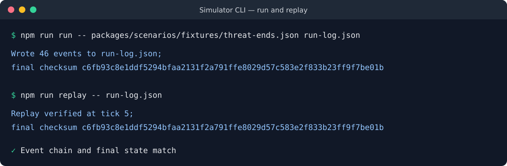
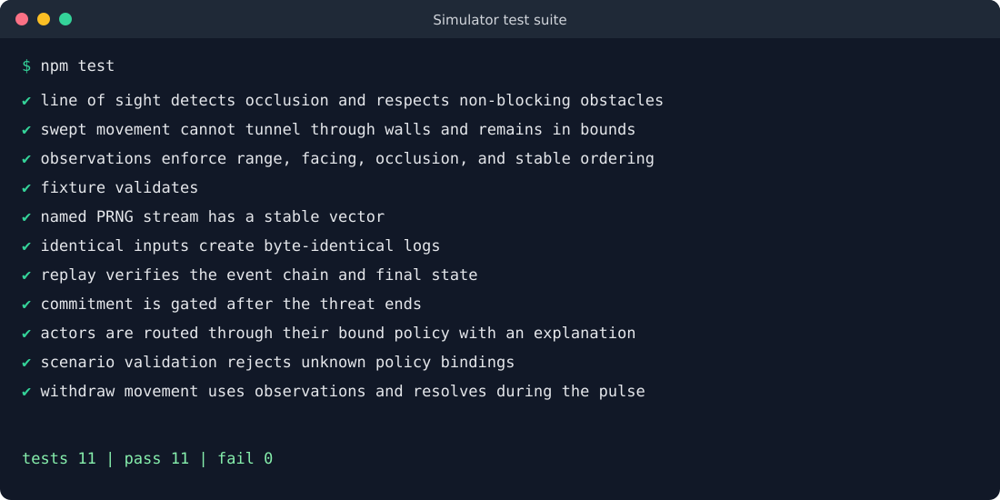

# Hey, I'm Livin' Here — Combat Simulator

A deterministic, explainable scenario simulator for comparing defensive decisions under pressure. The engine uses abstract, non-instructional effects and treats protection, separation, and disengagement as successful outcomes. Offensive commitment is prohibited after a scenario's threat ends.

> **Project status:** Phase 2 foundation. The repository contains a headless engine and CLI; it is not a complete real-world model, safety certification, or source of legal advice.

Phase 0 is complete: its architecture decisions, safety policy and review, threat model, decision register, and benchmark baseline are recorded under `docs/`.

## Current capabilities

- Seeded 100 ms simulation pulses and named PCG32 random streams.
- Stable actor ordering and checksum-chained, versioned event logs.
- Replay that re-runs a scenario and verifies both its event chain and final state.
- Range-, facing-, active-state-, and occlusion-aware actor observations.
- Rectangular obstacles with independent vision and movement blocking flags.
- Simultaneous movement proposals, map-bound clamping, and swept collision that prevents tunneling.
- A default safety gate that replaces post-threat commitment with withdrawal.
- Actor policy bindings with safety-first and random-valid policy plug-ins and explainable candidate scores.
- Explainable tempo profiles from readiness, stamina, shock, and bounded contact-stream noise, plus deterministic interrupt eligibility for mutual commitments.
- Scenario validation for identifiers, numeric limits, positions, obstacles, and vision/movement settings.
- A reviewed Phase 0 safety baseline with prohibited-content linting, threat modeling, closed architecture decisions, and a repeatable 32-actor benchmark fixture.

## Requirements

- Node.js 24 or newer. The repository uses Node's built-in TypeScript type stripping.
- npm (bundled with Node). There are no runtime or development package dependencies.

## Quick start

```bash
npm test
npm run benchmark
npm run validate -- packages/scenarios/fixtures/threat-ends.json
npm run run -- packages/scenarios/fixtures/threat-ends.json run-log.json
npm run replay -- run-log.json
```

The CLI defaults to `packages/scenarios/fixtures/threat-ends.json` when an input is omitted. `run` writes a self-contained artifact with the scenario, initial and final state, immutable events, engine version, and final checksum.

## Scenario format

Scenarios are JSON documents with schema version `1.0.0`. Positions and map dimensions are in metres; facing and vision arcs are in degrees; movement speed is metres per second.

```json
{
  "schemaVersion": "1.0.0",
  "id": "example",
  "name": "Occluded withdrawal example",
  "seed": 77,
  "pulseMs": 100,
  "maxTicks": 5,
  "map": {
    "width": 10,
    "height": 10,
    "obstacles": [
      {
        "id": "barrier",
        "x": 4,
        "y": 2,
        "width": 1,
        "height": 6,
        "blocksVision": true,
        "blocksMovement": true
      }
    ]
  },
  "threat": { "active": true, "endsAtTick": 3 },
  "actors": [
    {
      "id": "defender",
      "side": "protected",
      "position": { "x": 2, "y": 5 },
      "facingDegrees": 0,
      "visionRange": 10,
      "visionArcDegrees": 120,
      "movementSpeed": 1.4,
      "readiness": 0.8,
      "stamina": 1,
      "resolve": 0.8,
      "threatened": true
    }
  ]
}
```

Obstacle flags default to blocking when omitted. Vision settings default to a 20 m range, 120° arc, and 0° facing. Movement speed defaults to 1.4 m/s. Invalid or out-of-map values are rejected before simulation.

## Pulse behavior

For each pulse implemented by the current vertical slice, the engine:

1. Applies the scheduled threat transition.
2. Builds observations from a stable actor snapshot using range, facing, and line of sight.
3. Invokes each actor's bound policy, records its candidates, rationale, and random samples, then safety-gates the selected intent.
4. Computes explainable tempo profiles and interrupt eligibility for mutually visible opposing commitments.
5. Computes all withdrawal movement proposals from the same post-intent snapshot.
6. Applies map bounds and swept obstacle collision, then records every movement result.
7. Emits checksum-chained observation, intent, tempo, interrupt, movement, and lifecycle events.

Withdrawal moves directly away from the nearest visible actor on another side. Ties are resolved by stable actor ID. If there is no visible opponent, the actor holds position; collision rejects the full movement rather than allowing an actor to tunnel through an obstacle.

## Event log and replay

Every event records a schema version, sequence number, tick, payload, prior checksum, and its own checksum. Replay rejects sequence gaps, broken prior-checksum links, modified events, and final-state divergence. Because replay executes the bundled scenario again, artifacts should be retained with the engine version that created them.

## Tests

Run the complete suite with:

```bash
npm test
```

The suite covers all named PRNG vectors, fresh-process byte-identical logs, replay integrity, the post-threat safety gate, prohibited-content rejection, scenario validation, line-of-sight occlusion, swept collision, map bounds, observation ordering, observation-driven withdrawal, tempo traces, and interrupt eligibility. The benchmark command reports the current 32-actor, 600-pulse median and p95 against the provisional Phase 2 budget.

## Screenshots

The CLI run and replay report the same checksum, demonstrating that replay reconstructed the recorded policy-enabled result.



The current automated suite exercises the deterministic engine, policy bindings, safety gate, validation, sensing, and movement behavior.



## Development diary

### 2026-07-29 — Explainable policy boundary

- Replaced intent selection embedded in the engine with a versioned policy contract.
- Added `safety-first` and `random-valid` baselines so scenario actors can explicitly declare how they choose candidate actions.
- Kept the rules-of-engagement gate in the engine. Policies propose actions; they cannot bypass the post-threat commitment prohibition.
- Added `policy-decided` events containing candidate scores, feature contributions, rationale, and bounded random samples. This is the first increment toward full per-tick trace records.
- Added validation and regression coverage for actor policy bindings, then refreshed the CLI and test screenshots to reflect the policy-enabled event log.

### 2026-07-29 — Sensing and simultaneous withdrawal

- Added range, facing, actor activity, and obstacle occlusion to the observation snapshot.
- Added simultaneous withdrawal proposals, map-bound clamping, and swept obstacle collision.
- Documented the author, validation, run, replay, and inspection workflows while keeping the implementation headless.

### 2026-07-29 — Deterministic vertical slice

- Established the 100 ms pulse loop, named PCG32 streams, stable actor ordering, and checksum-chained events.
- Added the `validate`, `run`, and `replay` CLI commands and the threat-termination safety fixture.
- Chose deterministic rerun verification for the first replay implementation; periodic snapshots and branch-from-tick remain later roadmap work.

### Next

The next Phase 2 increment is abstract contact and simultaneous effect packets, followed by recovery, objectives, terminal conditions, and complete trace records. These mechanics will remain deterministic and will apply effects simultaneously to avoid actor-order bias.

## Repository layout

```text
apps/cli/                 validate, run, and replay commands
packages/engine/          deterministic simulation, PRNG, geometry, sensing, checksums
packages/policies/        policy contracts and built-in baseline policies
packages/schema/          shared types and runtime scenario validation
packages/scenarios/       canonical fixtures
tests/                    engine and geometry integration tests
docs/decisions/           architecture decision records
docs/images/              README command screenshots
```

See [`IMPLEMENTATION_PLAN.md`](IMPLEMENTATION_PLAN.md) for the roadmap, acceptance criteria, safety boundaries, and remaining phases.
