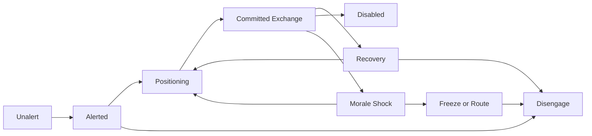
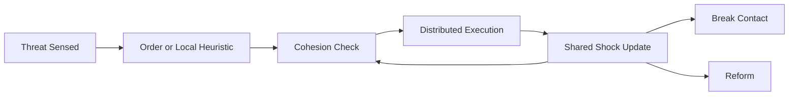
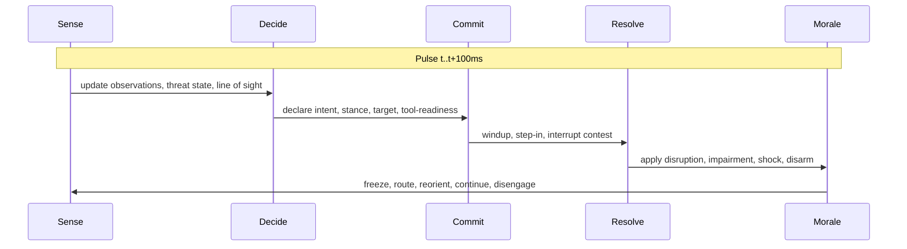
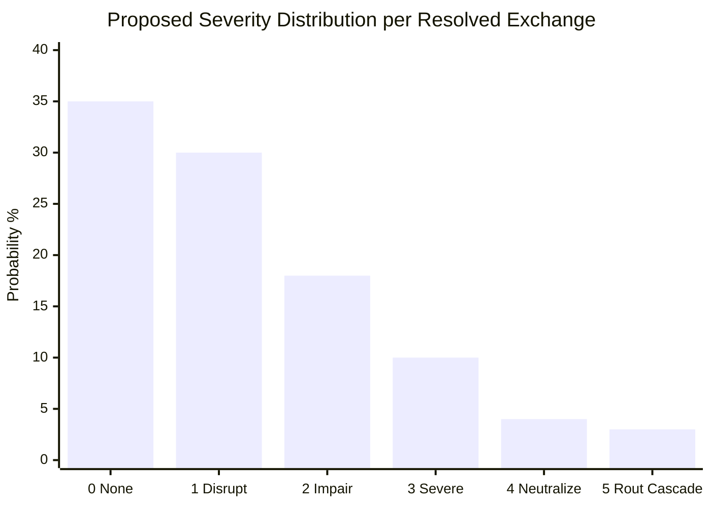

# Central Reference Architecture for a Tactical Combat Simulator Inspired by Chen Hegao's Unlimited Combat

## Executive Summary

The most defensible reading of Chen Hegao’s corpus is that it is **not** a conventional sportive fighting style with a stable catalog of ring-legal combinations. It is better modeled as an **asymmetric crisis-response doctrine** built around sudden commitment, surprise, improvised tool use, vulnerable-zone targeting, psychological shock, legal framing, and rapid termination of the encounter. Chen’s own labels and current branding point to this: the older internal materials circulate as **“Unlimited Combat”** or **“Unlimited Combat Technique”** rather than “Mad Dog Fist,” while Chen’s currently verified Bilibili account presents him as a coach in **“critical-moment counterattack”** and repeatedly frames the instruction as self-defense “customized for ordinary people.” Community discussions consistently treat “Mad Dog Fist” as a popular nickname rather than the cleanest canonical label. citeturn8view1turn15search1turn15search5turn21view0

The evidence base, however, is **fragmentary**. The main fixed text appears to be the internally circulated 1997 manual *Extremely Powerful, Practical — Unlimited Combat Technique*; a second important training text is *Train Everything for Real Combat*; and Chen’s current short-video channels add present-day terminology and pedagogic emphasis. But these materials were not formally published in a normal ISBN/distribution pipeline, and much of what circulates today survives as reposted scans, mirrors, video aggregations, course-title lists, and partial unofficial translations. That means a simulator should not pretend to recover a single exact “official ruleset.” The correct deliverable is an **annotated synthetic reference document** that distinguishes what is explicit, what is inferred, and what is implementation convenience. citeturn8view1turn8view2turn11search0turn11search2

For simulation purposes, the strongest fit is a **hybrid pulse-time engine** with **simultaneous intent declaration**, **bounded stochastic resolution**, **continuous 2D positioning**, **layered physical and psychological effects**, and a **strong morale-cascade model**. That recommendation follows directly from the source pattern: Chen’s materials and current videos emphasize abrupt commitment, body-step coupling, eye training, “attack-defense integration,” “chaotic” but purposeful attack sequencing, and the idea that dropping or shocking one adversary can rout the rest. They also repeatedly distinguish the method from ring fighting, including Chen’s own public line that on a formal platform his side may “not win even one move,” which strongly implies that the system should underperform in symmetric sport-duel scenarios and overperform in short, asymmetric crisis scenarios. citeturn20search0turn20search1turn19view0turn21view0turn14search4

Because the source corpus often uses overtly lethal language and scenario examples, the safest and most reusable simulator abstraction is **effect-centric rather than anatomy-centric**. Instead of encoding real-world harmful detail, represent outcomes as **disruption, impairment, shock, disarm, rout, and neutralization**. That preserves fidelity to the documented emphasis on surprise, weakness exploitation, intimidation, and rapid collapse, while keeping the reference document suitable for a game/simulator implementation rather than a real-world tactics manual. citeturn5search2turn19view0

## Source Base and Evidentiary Status

As of **July 29, 2026**, the highest-value source stack is three-layered. First are **self-authored or current official materials**: Chen’s verified Bilibili profile and videos under **陈鹤皋-蓝盾防卫特训**, plus named doctrines and slogans surfacing through those uploads. Second are **older primary or quasi-primary texts**: the 1997 internal *Unlimited Combat* manual and *Train Everything for Real Combat*, which survive mainly through mirrors, listings, and community circulation. Third are **community analyses and interviews**, especially direct interviews with Chen and close readings by Chinese-language commentators. English-language access appears limited and mostly unofficial; available translations are partial and user-uploaded rather than editorially verified. citeturn15search1turn8view1turn5search2turn19view0turn11search0turn11search2

| Source class | What it contributes | Evidentiary value | Main limitations |
|---|---|---:|---|
| Verified current Bilibili account **陈鹤皋-蓝盾防卫特训** | Current self-description, current terminology, present branding, present teaching emphasis such as “critical-moment counterattack” and “customized for ordinary people” citeturn15search1turn21view0turn21view1 | High | Short-video titles and tags are not full doctrine texts |
| 1997 internal manual *极厉害、实用的——无限制格斗术* | Oldest fixed doctrinal anchor in circulation; legal warning frame; explicit asymmetry and non-sport orientation citeturn8view1turn19view0 | High | Hard to verify against a complete pristine original copy in this pass |
| *一切为了实战而练* | Training priorities, conditioning categories, “three-part fight sequence,” “step/body method,” mindset framing citeturn5search2turn16search3 | Medium-high | Survives mainly through reposts, mirrors, and listings |
| Direct interview coverage | Biographical origin story, legal framing, “one retreat, two shout, three counterattack,” disciples, current self-interpretation citeturn19view0 | Medium-high | Journalistic paraphrase and mirrors, not stenographic source packets |
| Reposted training/course lists | Names of modules: eye training, guard stance, stepwork, “chaotic attack” idea, attack-defense unity, etc. citeturn12view0turn20search0turn20search1 | Medium | Reposters are not canonical curators |
| Unofficial English translation uploads | English terminology discovery and rough cross-lingual access citeturn11search0turn11search2 | Low-medium | Fragmentary and unverified |

The main ambiguities that matter for simulation design are below. I recommend making them explicit in the reference document rather than hiding them in code.

| Topic | What the source base supports | Confidence | Recommended simulator assumption |
|---|---|---:|---|
| Canonical name | “Unlimited Combat” / “Unlimited Combat Technique” is the cleaner internal label; “Mad Dog Fist” is a popular nickname; current branding also uses “critical-moment counterattack.” citeturn8view1turn15search1turn15search5 | High | Use `ChenUnlimitedCombat` as canonical namespace; keep aliases for search and UI |
| Fixed move list | Sources show modules, principles, and scenarios more than a tightly enumerated move taxonomy. citeturn12view0turn20search0turn20search1 | Medium-high | Model **capabilities and decision heuristics**, not named combo trees |
| Time model | No formal turn or timing system appears in the corpus. | High that it is unspecified | Use 100 ms pulses with interrupt windows |
| Hit locations | Sources emphasize vulnerable targets, but not in a formal simulator-compatible zone map. citeturn8view1turn19view0 | Medium-high | Use abstract zones: `headline`, `centerline`, `mobility`, `grip/tool`, `morale` |
| Weapon statistics | Source corpus talks about legal everyday carry and improvised tools, not clean stat blocks. citeturn19view0turn13view0turn15search2 | High that it is unspecified | Use tool classes with traits: reach, concealment, durability, intimidation |
| Morale | Strongly implied by slogans such as “drop one, scare off nine” and “strike while frightening the rest,” but not numerical. citeturn21view0turn19view0 | High that morale is central, low on exact math | Make morale a first-class subsystem |
| Squad doctrine | Chen has anti-riot / prison / police teaching associations, but extant public materials remain mostly individual or small-group oriented. citeturn8view1turn19view0 | Medium | Build squad scale as a wrapper around the individual engine |

## Analytic Extraction of System Principles

The source record points to a doctrine with five recurring pillars. First, it is **asymmetric**, not sportive. Chen’s current and archived materials repeatedly frame the method as something for crisis response, not ring exchange, and Chen publicly concedes the ring mismatch himself. Second, it is **legally gated**: Chen’s interview and community summaries alike foreground mundane legal study and the doctrine of justified defense as part of entry-level instruction. Third, it is **psychological as much as physical**: the corpus foregrounds vocalization, intimidation, “body-sound” and “body-step” coupling, eye training, and rout effects on bystanders or additional attackers. Fourth, it is **situational and environmental**: widely circulated modules focus on everyday objects, sudden encounters, and “critical-moment” counters rather than elaborate sportive setups. Fifth, it is **short-horizon and termination-oriented**: current official messaging emphasizes exhaustive repetition for a single decisive crisis moment rather than long, point-scoring exchanges. citeturn19view0turn12view0turn20search0turn21view0turn21view1

The terminology that appears most useful for a simulator glossary is below. Where a translation is interpretive rather than explicit, I mark it as a modeling translation rather than a definitive philological one.

| Source term | Best-use English label | Modeling translation |
|---|---|---|
| 无限制格斗术 | Unlimited Combat Technique | Whole doctrine namespace citeturn8view1turn12view0 |
| 极危时刻反击术 | Critical-Moment Counterattack | Present-day self-framing for emergency-defense instruction citeturn15search1turn21view0 |
| 身声互追 | Body-sound coupling | Movement synchronized with vocal/intimidation burst; morale and commitment modifier citeturn5search0turn5search3 |
| 身步互追 / 步法互追 | Body-step coupling / step-chase practice | Locomotion and attack-ready timing synchronization citeturn5search0turn20search0 |
| 对敌眼神训练 | Adversary gaze training | Target fixation, read quality, reaction prep citeturn20search0 |
| 长矛手警戒式 | Long-spear-hand guard | Extended guard / high-readiness posture citeturn20search0 |
| 乱打理念 | “Chaotic” attack principle | Variable, hard-to-read sequencing; not literal randomness citeturn20search0turn20search1 |
| 攻防合一 | Attack-defense unity | Actions can create offense and protection in the same commit window citeturn20search0 |
| 正当防卫 | Justified defense | Legal gating rule for action escalation citeturn19view0 |
| 见义勇为 | Intervention for justice / courageous aid | Moral and group-level intervention trigger citeturn19view0 |

From those principles, the simulator should encode the following **decision rules** as doctrine, not flavor text. The unit should prefer **avoiding symmetric exchange**; if threat severity does not cross a configured legal/emergency threshold, it should prefer withdrawal, shielding, or verbal disruption rather than commit. Once a threshold is crossed, the doctrine should prefer **first-exchange asymmetry**: surprise, angle, environmental advantage, and tool-readiness matter more than prolonged accuracy. The doctrine should also weight **telegraph suppression** and **perceived irrationality/intimidation** as tools for degrading opponent read quality. After any decisive effect, the model should immediately evaluate **morale cascade** in nearby enemies. And once the threat state ends, the model should sharply penalize pursuit or overcommit, reflecting the source corpus’s repeated attention to justified-defense boundaries and the distinction between defense and unlawful fighting. citeturn19view0turn21view0turn21view1

One especially important design conclusion follows from the ring mismatch material. Because Chen publicly positions his method as poor for formal platform fighting while current course lists and community analyses present it as optimized for sudden crisis, the simulator should deliberately distinguish between **duel advantage** and **crisis advantage**. In an open, regulated, one-on-one sporting arena with no environmental leverage, no surprise, and no morale-chain targets, a Chen-inspired agent should often lose to a specialist sportive baseline. In a short, noisy, ambiguous emergency with high fear, poor visibility, and nearby tools or obstacles, the same agent should gain a large relative advantage. That asymmetry is central to source fidelity. citeturn13view0turn14search4turn17search3

## Recommended Simulation Model

The table below compares alternative design choices. The recommendations are optimized for **source faithfulness, explainability, and vibe-coding practicality**.

| Design axis | Plausible options | Recommended choice | Rationale |
|---|---|---|---|
| Time | Fully continuous event queue; fixed turns; hybrid pulses | **Hybrid pulses** of 100 ms with interrupt windows | Captures sudden entries and reactions without making engine debugging opaque |
| Intent scheduling | Strict initiative order; simultaneous; AP-based | **Simultaneous intent declaration** then contest resolution | Best fit for surprise, interruption, and “attack-defense unity” |
| Space | Grid; coarse range bands; continuous 2D/navmesh | **Continuous 2D with sectorized facing** | Preserves angle, flanking, crowding, and visibility |
| Contact outcome | Deterministic formula; dice table; probabilistic curve | **Bounded stochastic curve** | Matches high-variance, low-duration source feel |
| Damage | HP only; hit-location anatomy; layered effects | **Layered effects**: disruption, impairment, shock, rout, neutralization | Safer and more source-faithful than pure HP |
| Morale | None; team-only; individual + team | **Individual + team morale** | Necessary for “strike one, frighten many” behavior |
| Sensing | Full information; LOS only; LOS + hearing + telegraph | **Probabilistic LOS + hearing + telegraph** | Fits eye training, shouting, concealment, surprise |
| Resource model | Stamina only; complex inventory sim; compact layered resources | **Compact layered resources** | Good tradeoff for vibe-coding |
| Scale | Individual only; squad-only aggregate; micro-to-meso | **Micro individual engine with squad wrapper** | Respects source individual focus while allowing police/anti-riot scaling |

The core state should be represented with a small number of orthogonal layers rather than a giant move table.

| Layer | Recommended state variables | Typical inputs | Typical outputs |
|---|---|---|---|
| Physical body | mobility, balance, stamina, impairment, guard integrity | terrain, collisions, prior effects | position penalties, vulnerability windows |
| Intent/tempo | readiness, commitment, windup, recovery, interruptibility | player/AI intent, stance | first-move edge, cancel windows |
| Sensing | vision cone, hearing radius, noise signature, attention target | lighting, cover, shouting, crowd noise | awareness state, surprise modifiers |
| Morale/psychology | fear, aggression, resolve, shock, pain tolerance, cohesion | nearby ally/enemy outcomes, intimidation, surprise | route, freeze, reckless commit |
| Loadout/tool state | tool class, readiness, concealment, durability | carried items, environment pickups | reach changes, intimidation, disarm risk |
| Legal/engagement gate | threat severity, threatened parties, prosecution-risk flag | scenario script, ROE, escalation level | whether doctrine will commit or withdraw |
| Squad scale | leader link, order channel, cohesion, frontage pressure | command orders, losses, line break | formation breakup, morale diffusion |

The following **agent state machine** is the best compact representation.



A squad-level wrapper should be separate from the agent microstate so that the same engine can scale from one-on-one to crowd or escort scenarios.



For timing, I recommend a short **five-phase pulse**. It is simple enough for vibe-coding but still captures “suddenness,” interruptions, and morale-cascade logic.



The most source-faithful damage model is **high variance with a low median but meaningful right tail**. That is because the corpus repeatedly emphasizes decisive first-contact success, intimidation, and rout effects, while current official messaging stresses repeated drilling for a short crisis window rather than attritional sporting exchange. The chart below is therefore a **proposed implementation distribution**, not a claim that Chen published these exact numbers. It is suitable for a single resolved exchange after position, surprise, and guard have already been accounted for. citeturn19view0turn21view0turn21view1



Randomness should be **seeded and bounded**. The engine should not roll a single flat “hit/miss” die. Instead, sample small noise on top of explicit contributors:

- `tempo contest`
- `surprise delta`
- `angle advantage`
- `tool/reach advantage`
- `guard and cover`
- `shock and composure`
- `terrain friction / crowding`

A useful formula skeleton is:

```text
tempo_score = readiness + stance_bonus + surprise_bonus - stress - encumbrance + noise
contact_quality = skill + angle + reach + intent_bonus - target_guard - cover + noise
severity_input = contact_quality + morale_shock_bonus - stability - armor_like_protection
```

Resource management should stay compact. I recommend five resources:

| Resource | Meaning | Why it matters in this model |
|---|---|---|
| Stamina | Physical output budget | Needed for movement bursts and repeated commits |
| Resolve | Willingness to act under fear/pain | Central to Chen-style shock dynamics |
| Surprise | Hidden preparation / unreadability budget | Core asymmetric advantage |
| Tool readiness | How quickly a carried or nearby tool can be brought to bear | Source corpus strongly favors ordinary carry and environment |
| Legal headroom | Whether the doctrine is still in a justified-defense state | Needed to stop pursuit/escalation after threat ends |

## Implementation Blueprint

Because the corpus is principle-heavy and numerically sparse, the cleanest implementation pattern is **schema first, engine second, UI third**. In other words: define a stable scenario schema, a stable actor schema, and a deterministic step API before tuning any doctrine weights. That approach is especially appropriate here because the underlying source base is itself composite and partially unofficial. citeturn8view1turn8view2turn11search0

### Core pseudocode

```text
function step_sim(state, intents, config, seed):
    rng = PRNG(seed)

    observations = build_observations(state, config, rng)
    gated_intents = apply_engagement_gates(intents, state, observations, config)

    precommit = []
    for actor in state.actors:
        precommit.append(
            compute_commit_profile(
                actor,
                gated_intents[actor.id],
                observations[actor.id],
                config,
                rng
            )
        )

    moved_state = resolve_movement_and_spacing(state, precommit, config, rng)
    contests = build_contact_contests(moved_state, precommit, config)

    effect_packets = []
    for contest in contests:
        tempo = resolve_tempo_contest(contest, rng)
        if tempo.interrupted:
            effect_packets.append(make_interrupt_packet(contest))
            continue

        contact = resolve_contact_quality(contest, rng)
        severity = resolve_effect_severity(contact, contest, rng)

        effect_packets.append(
            make_effect_packet(
                source=contest.attacker_id,
                target=contest.defender_id,
                disruption=severity.disruption,
                impairment=severity.impairment,
                shock=severity.shock,
                disarm=severity.disarm,
                neutralization=severity.neutralization
            )
        )

    post_effect_state = apply_effect_packets(moved_state, effect_packets, config)
    morale_state = update_individual_morale(post_effect_state, effect_packets, config, rng)
    squad_state = update_squad_cohesion(morale_state, effect_packets, config, rng)
    legal_state = update_legal_headroom(squad_state, observations, config)

    traces = build_explainability_traces(
        old_state=state,
        new_state=legal_state,
        observations=observations,
        intents=gated_intents,
        precommit=precommit,
        effects=effect_packets
    )

    return StepResult(
        state=legal_state,
        effects=effect_packets,
        traces=traces,
        seed_used=seed
    )
```

### Doctrine policy layer

A Chen-inspired policy should sit above the engine as a **weight set**, not as hardcoded unique mechanics. That lets you compare doctrines cleanly.

```text
DoctrineWeights:
  prefer_asymmetry: 0.95
  prefer_environmental_tool: 0.80
  prefer_short_horizon_commit: 0.90
  prefer_morale_shock_targets: 0.85
  tolerate_symmetric_duel: 0.15
  pursue_after_threat_ends: 0.05
  value_surprise: 0.90
  value_angle_change: 0.75
  value_group_rout_effect: 0.88
```

### Data schemas

```json
{
  "ScenarioSpec": {
    "id": "string",
    "map": {
      "width": 20,
      "height": 20,
      "obstacles": [],
      "coverZones": [],
      "lightZones": [],
      "navmesh": []
    },
    "rules": {
      "pulseMs": 100,
      "seed": 12345,
      "engagementModel": "justified-defense",
      "timeModel": "hybrid-pulse"
    },
    "actors": []
  }
}
```

```json
{
  "ActorState": {
    "id": "string",
    "side": "A",
    "role": "individual|leader|support",
    "position": { "x": 0.0, "y": 0.0, "facingDeg": 0.0 },
    "body": {
      "mobility": 1.0,
      "balance": 1.0,
      "stamina": 1.0,
      "impairment": 0.0,
      "guardIntegrity": 1.0
    },
    "mind": {
      "awareness": "unalert|alerted|tracking",
      "fear": 0.2,
      "resolve": 0.8,
      "shock": 0.0,
      "aggression": 0.5
    },
    "loadout": {
      "carriedToolClass": "none|shortTool|flexTool|longTool|shieldLike",
      "ready": false,
      "durability": 1.0,
      "concealment": 0.7
    },
    "senses": {
      "visionRange": 8.0,
      "visionArcDeg": 140,
      "hearingRange": 10.0,
      "attentionTarget": null
    },
    "squad": {
      "squadId": "string|null",
      "cohesion": 0.7,
      "leader": false
    },
    "tags": ["chen-inspired"]
  }
}
```

```json
{
  "ActionIntent": {
    "actorId": "string",
    "kind": "observe|reposition|ready-tool|protect|commit|withdraw|aid-ally|rally",
    "targetId": "string|null",
    "targetPoint": { "x": 0.0, "y": 0.0 },
    "commitment": 0.0,
    "telegraphSuppression": 0.0,
    "intimidationBurst": 0.0,
    "notes": "free-form for debugging"
  }
}
```

```json
{
  "EffectPacket": {
    "sourceId": "string",
    "targetId": "string",
    "disruption": 0.0,
    "impairment": 0.0,
    "shock": 0.0,
    "disarm": false,
    "neutralization": false,
    "routCascadeHint": 0.0
  }
}
```

### API and interface definitions

For vibe-coding integration, the engine should expose a small, JSON-native surface. I recommend the following contract:

```text
create_simulation(scenario_spec, doctrine_library, config) -> { simulation_id }

step_simulation(simulation_id, action_batch, seed?) -> {
  state,
  effects,
  traces,
  done
}

run_episode(scenario_spec, policy_bindings, config, seed) -> {
  final_state,
  event_log,
  metrics
}

batch_evaluate(experiment_spec) -> {
  aggregate_metrics,
  seed_summaries,
  scenario_breakdown
}

explain_trace(simulation_id, tick, actor_id?) -> {
  observations,
  candidate_actions,
  chosen_action,
  doctrine_weights,
  random_rolls
}
```

An HTTP/OpenAPI-flavored surface can be equally simple:

```yaml
POST /simulations
POST /simulations/{id}/step
POST /simulations/{id}/run
POST /experiments/batch
GET  /simulations/{id}/state
GET  /simulations/{id}/trace/{tick}
```

For LLM-assisted coding, two interface properties matter more than anything else:

First, every call should be **seed-stable**. If the same scenario, doctrines, and seed are supplied, the result must be identical.

Second, every step should be **explainable**. The engine should return not just state deltas but also a trace such as:

```json
{
  "actorId": "A1",
  "tick": 42,
  "chosenAction": "commit",
  "why": {
    "threatSeverity": 0.92,
    "surpriseOpportunity": 0.61,
    "groupRoutPotential": 0.54,
    "legalHeadroom": 0.88,
    "symmetricDuelPenalty": -0.37
  }
}
```

That kind of trace is essential if the document is going to function as a **central reference spec** for vibe-coding rather than just lore.

## Testing and Validation

A useful validation framework should test both **engine correctness** and **source-faithful behavior**. Because the source material is not a clean competitive-sport dataset, the standard for “accuracy” should not be tournament win-rate prediction. The better standard is whether the simulator reproduces the **qualitative signatures** that the source corpus makes central: crisis asymmetry, strong morale effects, environment sensitivity, legal gating, and weak performance in formalized symmetric-duel contexts. citeturn19view0turn21view0turn14search4

### Recommended scenario suite

| Scenario | What it tests | Expected Chen-inspired result |
|---|---|---|
| Open regulated duel, equal visibility, no tools, no crowd | Ring mismatch | Underperform against a sportive striking baseline |
| Sudden close-range crisis, poor visibility, high threat | Surprise and crisis advantage | Outperform baseline if first exchange succeeds |
| One vs three with bystanders and narrow movement lanes | Morale cascade | If one opponent is strongly shocked early, group resolve should drop sharply |
| Threat ends after first decisive exchange | Legal gating | Chen-inspired doctrine should disengage, not chase |
| Crowd-noise environment with intermittent LOS | Sensing and telegraph | Eye-training and awareness advantages should matter more than raw strike score |
| Four-person squad escort against scattered aggressors | Scaling | Squad cohesion and leader-presence should shape outcome as much as individual skill |

The following **unit tests** capture the minimum viable correctness layer.

```text
test_seed_reproducibility():
    result1 = run_episode(spec, policies, config, seed=77)
    result2 = run_episode(spec, policies, config, seed=77)
    assert result1.event_log == result2.event_log

test_no_pursuit_after_threat_end():
    state = fixture_threat_collapses_on_tick_3()
    result = step_sim(state, intents, config, seed=12)
    assert result.state.actors["chen"].intent != "pursue"

test_morale_cascade_after_first_decisive_effect():
    state = fixture_one_vs_many()
    result = run_episode(state, policies, config, seed=88)
    assert count_routed(result.final_state.enemy_team) >= 1

test_ring_mismatch_behavior():
    result = batch_duel_eval(chen_policy, sportive_policy, open_duel_suite)
    assert result.chen_win_rate < result.crisis_suite_chen_win_rate

test_interrupt_window_matters():
    state = fixture_simultaneous_commit()
    fast = run_episode(state, fast_doctrine, config, seed=9)
    slow = run_episode(state, slow_doctrine, config, seed=9)
    assert fast.metrics.interrupt_success_rate > slow.metrics.interrupt_success_rate

test_explainability_trace_complete():
    result = step_sim(state, intents, config, seed=1)
    assert "why" in result.traces[0]
```

### Validation metrics

| Metric | Definition | Target |
|---|---|---:|
| Reproducibility | Same seed, same outcome | 100% |
| Trace completeness | Steps returning full explanation metadata | > 95% |
| Crisis asymmetry differential | Win-rate delta between crisis scenarios and open-duel scenarios | Positive and material |
| Morale cascade frequency | Probability that first decisive effect alters nearby enemy resolve | Tuned to medium-high |
| Threat-end disengagement rate | Cases where doctrine stops after threat state clears | Very high |
| Sensitivity monotonicity | More surprise/reach/angle should never systematically reduce success | 100% monotone in regression tests |
| Doctrine distinctiveness | Chen-inspired policy should behave measurably differently from sportive baseline | Clearly separable |

A final validation pass should include **human review against source traits**. The checklist should ask:

- Does the engine reward **asymmetry** more than prolonged fair exchange?
- Does it model **shock and intimidation** as consequential, not decorative?
- Does it allow **everyday tool classes** and environmental leverage?
- Does it produce **one-to-many morale cascades**?
- Does it sharply punish **post-threat pursuit**?
- Does it show poor fit for **formal dueling** relative to crisis defense?

If a build fails those checks, it may still be a good combat simulator, but it is not a good **Chen-inspired** one. citeturn19view0turn21view0turn13view0

## Prioritized Sources

The source list below is ordered by how useful each item is for building and maintaining a central reference document.

| Priority | Source | Why it should be read first | Caveat |
|---|---|---|---|
| Highest | Verified Bilibili profile **陈鹤皋-蓝盾防卫特训** citeturn15search1 | Best current self-description; confirms present branding as **极危时刻反击术** | Short bio, not a full doctrine text |
| Highest | Current official Bilibili uploads and titles from that account, including “customized for ordinary people,” “drop one, scare off nine,” “practice 500 times for one crisis moment,” and formal-duel mismatch references citeturn21view0turn21view1turn14search4 | Best window into current teaching emphasis: morale, crisis timing, ordinary-person framing, non-ring identity | Titles are compressed rhetoric |
| Highest | *极厉害、实用的——无限制格斗术* (1997 internal manual), as documented in multiple mirrors and commentaries citeturn8view1turn19view0 | Oldest coherent doctrinal anchor in circulation; establishes asymmetry, legal warnings, and non-sport framing | Hard to verify against a single definitive archival copy in this session |
| High | *一切为了实战而练* / *Train Everything for Real Combat* citeturn5search2turn16search3 | Best training-priorities source: conditioning, body/step method, mindset, “three-part fight sequence” | Mostly circulates through reposts and sales/mirror pages |
| High | Upstream News interview with Chen, mirrored on Sohu on June 14, 2022 citeturn19view0 | Best direct-source interview for legal framing, biography, doctrine summary, and current interpretation | Journalistic mediation |
| High | Reposted 9-part Bilibili training collection showing module names such as nunchaku/short stick/long stick, step-body work, daily training, philosophy citeturn12view0 | Useful for extracting a module-based curriculum skeleton | Reposted by a fan account |
| High | Reposted 40-lesson course index with modules such as eye training, guard stance, body-step integration, “chaotic attack” principle, attack-defense unity, knees, elbows, stance, and movement drills citeturn20search0turn20search1 | Excellent for deriving simulator tags and capability categories | Again, reposted rather than official archive |
| Medium | QQ/篝火 reading note on the manual citeturn8view2 | Good for tempering interpretation and confirming the harsh tone/readability of the text | Critical commentary, not primary |
| Medium | 3DM feature article on Chen and the 1997 manual citeturn8view1 | Good synthetic overview of doctrine, publication status, and ring mismatch framing | Magazine-style feature, not a primary text |
| Medium | Unofficial English translation on Scribd and translation-seeking English-language discussions citeturn11search0turn11search2 | Useful for cross-language terminology discovery | Fragmentary, unverified, low editorial confidence |

The central implementation takeaway is straightforward: **treat Chen Hegao’s system as a doctrine of asymmetric emergency action, not as a rules-clean martial sport.** Build the simulator around **tempo, surprise, morale shock, legal gating, environmental leverage, and fast termination**, and represent the resulting corpus as an **annotated reference spec with explicit assumptions** rather than a false reconstruction of a perfectly complete original. That is the most analytically rigorous, implementation-ready, and source-faithful path available from the materials presently accessible. citeturn19view0turn15search1turn20search0turn8view1